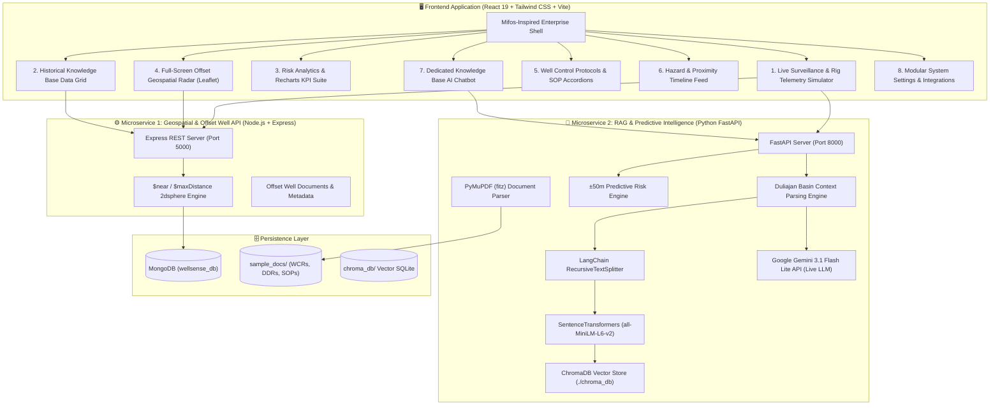

# 🛢️ WellSense AI — eRTMAC-NWIS
### Nearby Wells Intelligence System: AI-Powered Offset Well Knowledge & Drilling Decision Support Platform

[](https://oil-india.com)
[-orange.svg?style=for-the-badge)](https://oil-india.com)
[](https://oil-india.com)
[](https://react.dev)
[](https://nodejs.org)
[](https://fastapi.tiangolo.com)
[](https://www.trychroma.com)
[](https://ai.google.dev)

---

## 📌 1. Problem Statement Context & Challenge

* **Problem Statement ID:** `26121`
* **Problem Statement Title:** `eRTMAC-NWIS (Nearby Wells Intelligence System): An AI-Powered Offset Well Knowledge and Decision Support Platform for Drilling Operations`
* **Sponsoring Organization:** **Oil India Limited (OIL)**

### 📖 Background
Oil India Limited operates the **eRTMAC (electronic Real-Time Monitoring and Advisory Centre)**, capturing high-frequency sensor streams (WOB, ROP, Standpipe Pressure, Torque, Flow In/Out, Mud Weight) from active drilling rigs across Assam and other operational basins. 

However, drilling decisions in geologically complex formations (e.g., fractured **Tipam Sandstones** or overpressured **Barail Coal-Shale interbeds**) require more than isolated surface telemetry. Engineers need instant correlation with **offset wells** previously drilled in the same formation. 

### ⚠️ The Core Problem
1. **Scattered Institutional Memory:** Decades of operational learnings reside trapped across thousands of static Well Completion Reports (WCRs), Daily Drilling Reports (DDRs), and PDF logs.
2. **Slow Manual Lookups:** Searching through legacy archives during acute drilling crises (such as sudden mud losses or impending kicks) takes hours, turning preventable anomalies into catastrophic Non-Productive Time (NPT).
3. **Lack of Spatial-Stratigraphic Correlation:** Rig teams lacked a unified platform capable of superimposing historical offset incidents within a dynamic proximity radius relative to the active drill bit.
4. **Reactive Instead of Proactive:** Without automated lookahead alerts, crews encounter identical thief zones and sticking mechanisms repeatedly across adjacent wells.

---

## 💡 2. The Solution: WellSense AI (NWIS)

**WellSense AI** is an enterprise-grade **Nearby Wells Intelligence System (NWIS)** built to run alongside **eRTMAC**. It synthesizes geospatial proximity, real-time telemetry lookahead, and Retrieval-Augmented Generation (RAG) powered by **Google Gemini** and **ChromaDB** into an intuitive, corporate-grade dashboard.

```
       +-------------------------------------------------------------------------+
       |                           WELLSENSE AI (NWIS)                           |
       |               AI-Powered Drilling Decision Support System               |
       +-------------------------------------------------------------------------+
                                            |
       +--------------------+---------------+-------------------+
       |                    |                                   |
[1. Geospatial Intel] [2. RAG Knowledge Core]        [3. Predictive Lookahead]
  * MongoDB 2dsphere    * PyMuPDF PDF Parsing           * ±50m Hazard Detection
  * Leaflet Radar Map   * ChromaDB Vector Store         * Real-Time Telemetry
  * Radius Sliders      * Google Gemini 3.1 Flash LLM   * Institutional SOPs
```

---

## 🏛️ 3. High-Level System Architecture



---

## 🛠️ 4. Technology Stack Breakdown

| Layer | Technologies Used | Purpose |
| :--- | :--- | :--- |
| **Frontend Framework** | **React 19 (`react`, `react-dom`)** | Component-driven responsive Single Page Application (SPA). |
| **Styling & Design** | **Tailwind CSS v4** | Clean corporate UI, Mifos-inspired light palette (`#0077c8`), Gemini-style collapsible sidebar. |
| **Icons & Visuals** | **Lucide React** | Consistent, technical iconography across telemetry gauges, alerts, and navigation. |
| **Mapping & GIS** | **Leaflet & React-Leaflet** | Interactive geospatial offset well mapping, dynamic proximity radius circles, and custom popups. |
| **Data Visualization** | **Recharts** | Risk probability curves, historical incident histograms by formation, and safety scores. |
| **Backend 1 (Spatial)** | **Node.js, Express, Mongoose** | High-throughput API for active rig coordinates and `$near` 2dsphere offset queries. |
| **Primary Database** | **MongoDB (Local / Atlas)** | Spatial storage of 14+ Assam Basin wells with indexed coordinates, depths, and incident logs. |
| **Backend 2 (AI/RAG)** | **Python 3.13, FastAPI, Uvicorn** | Microservice handling document ingestion, vector retrieval, and live LLM generation. |
| **PDF Extraction** | **PyMuPDF (`fitz`)** | Lightning-fast page-by-page extraction of technical text from Well Completion Reports. |
| **Text Chunking** | **LangChain Text Splitters** | `RecursiveCharacterTextSplitter` with 1000-char chunks and 150-char sliding overlap. |
| **Vector Embeddings** | **SentenceTransformers (`all-MiniLM-L6-v2`)** | 384-dimensional dense semantic vectors computed locally on CPU. |
| **Vector Database** | **ChromaDB (`chromadb`)** | Embeddings persistence, cosine similarity indexing, and ground-truth document chunk retrieval. |
| **Live LLM** | **Google Gemini (`gemini-3.1-flash-lite`)** | High-speed, real-time AI reasoning with Duliajan geological prompt parsing. |

---

## 🚀 5. Core Modules & Operational Features

### 📡 1. Live Surveillance & Real-Time Drilling Simulator
* **Interactive Telemetry:** Live simulation of bit depth increments, WOB (klbs), RPM, ROP (m/hr), Standpipe Pressure (psi), and Rotary Torque.
* **Lookahead Risk Engine ($\pm$50m Window):** Automatically monitors the bit's current depth against nearby offset wells. If the bit is within 50m of a historical catastrophe (e.g. thief zone in `DLJN-HST-005` or sticking in `DLJN-04`), the system fires a critical alert and calculates exact probability.
* **Direct RAG AI Bridge:** One-click *"Consult Knowledge Base AI Tab →"* button automatically pre-fills the chatbot with active telemetry and hazard parameters.

### 🗃️ 2. Historical Knowledge Base (Data Grid)
* **Offset Well Records:** Tabular grid displaying offset wells across the Upper Assam Shelf.
* **Advanced Multi-Filter:** Real-time search by Well ID/Name, Formation (Tipam Sandstone, Barail, Namsang), and Incident Type (Mud Loss, Stuck Pipe, Kick).
* **Detailed Well Report Modal:** View comprehensive completion reports, casing programs, BHA details, and mitigation measures taken by previous driller crews.

### 📊 3. Risk Analytics Dashboard
* **Executive KPI Cards:** Summary metrics for *Total Offset Wells Analyzed*, *High-Risk Formations Identified*, *Overall Safety Score (85%)*, and *Active Predictions*.
* **Formation Incident Histogram:** Recharts bar chart contrasting Mud Losses vs. Stuck Pipe incidents across stratigraphic layers.
* **Depth vs. Risk Probability Curve:** Recharts line chart mapping predicted risk percentages down to target depth (3,850m).
* **Critical Risk Formations Matrix:** Tabular frequency analysis highlighting top geomechanical hazard zones in Duliajan.

### 🗺️ 4. Full-Screen Geospatial Offset Radar (80/20 Map)
* **GIS Map Canvas:** Centered on Duliajan, Assam (`27.3653° N, 95.3197° E`).
* **Visual Elements:** Distinct red pulsing marker for **Active Rig DLJN-ACT-001**, blue markers for historical wells, and an adjustable dynamic radius circle (default: 10km).
* **Filter Control Panel:** Sliders for search radius (1–30 km) and target depth, plus multi-select checkboxes for incident classification.
* **Interactive Popups:** Instant access to well depth, distance from active bit, primary risks, and quick links to historical dossiers.

### 📋 5. Well Control Protocols (Institutional Memory SOPs)
* **Categorized Accordion Layout:**
  1. *Lost Circulation Mitigation* (Thief zone isolation, LCM fiber bridging, hesitation squeeze, ECD stabilization).
  2. *Stuck Pipe Release Operations* (Differential vs. mechanical sticking diagnosis, downward jarring with trapped torque, weighted freeing pills).
  3. *Kick & Blowout Prevention* (Hard shut-in protocol, Driller's & Wait-and-Weight kill sheets, choke manifold control).
* **Institutional Memory Badges:** Specific steps feature evidence badges:
  - 🏷️ `Based on success in Offset Well DLJN-04`
  - 🏷️ `Based on success in Offset Well DLJN-HST-002`
  - 🏷️ `Based on success in Offset Well DLJN-HST-006`

### 🔔 6. Hazard & Proximity Notification Feed
* **Chronological Timeline:** Centered vertical feed connecting operational events and predictive warnings.
* **Severity-Coded Cards:**
  - 🔴 **High Risk:** *"Critical: Approaching 1200m Tipam Sandstone. 80% probability of Mud Loss based on well DLJN-HST-005."*
  - 🟡 **Warning:** *"Caution: Torque spike predicted at 1450m based on historical data."*
  - 🔵 **Safe Zone:** *"Safe Zone: Next 300m historically clear of major incidents."*
* **Interactive Driller Acknowledgment:** Rig engineers can acknowledge red critical alerts, recording a timestamped audit trail.

### 🤖 7. Knowledge Base AI (Live Gemini + ChromaDB RAG)
* **Two-Column Dedicated Workspace:** Chat transcript on the left, indexed PDF document library on the right.
* **Domain Context Parsing Engine:** Every query automatically injects Duliajan Basin stratigraphy, offset well incident histories, and active rig parameters into Google Gemini prompt.
* **Ground-Truth Citations:** Every AI response displays exact source document names, page numbers, and vector similarity scores.

### ⚙️ 8. System Settings & Modular Integrations
* **General Configuration:** Adjust Default Map Radius, Active Rig ID, Operating Basin, and Telemetry Polling Rate.
* **AI & RAG Modular Panel:** Configurable Vector DB URL, Gemini API Key (with show/hide toggle for judge demonstrations), model selectors, and a **"Re-index Historical Documents"** button.
* **Notification Preferences:** Toggle audio alarms, mud loss warnings, proximity alerts, and SMS/Email dispatches.

---

## 🌍 6. Geological Knowledge Base: Duliajan Basin Baseline

WellSense AI includes pre-configured stratigraphic intelligence for the **Upper Assam Shelf**:

```
+-------------+-----------------------+-------------------------------------------------------+
| Depth (m)   | Geological Formation  | Typical Geomechanical & Operational Hazards           |
+-------------+-----------------------+-------------------------------------------------------+
| 0 - 1,100   | Alluvium & Namsang    | Loose gravels, surface water zones, low integrity.    |
| 1,100 - 2,450| Tipam Sandstone Group | Sub-hydrostatic depleted sands, severe thief zones,   |
|             |                       | massive lost circulation (up to 65 bbl/hr).           |
| 2,450 - 3,950| Barail Coal-Shale     | Overpressured gas sands (pore pressure ramp to 1.34 SG)|
|             |                       | sloughing reactive coal seams, differential sticking. |
| 3,950+      | Kopili & Jaintia      | Deep overpressured shale and carbonate transition.    |
+-------------+-----------------------+-------------------------------------------------------+
```

### Verified Offset Wells in System:
* **`DLJN-04` (2.4 km W):** Total loss of returns at 1,180m MD; differential stuck pipe at 2,820m MD freed via 55 bbl oil-based freeing pill.
* **`DLJN-HST-001` (1.8 km N):** 12 bbl gas kick at 2,420m MD killed via Wait-and-Weight method (1.32 SG kill mud).
* **`DLJN-HST-002` (3.1 km NE):** Total mud loss at 1,350m MD controlled using 60 bbl mica/calcium carbonate LCM pill.
* **`DLJN-HST-005` (3.8 km NW):** Severe mud loss (65 bbl/hr) at 1,200m–1,240m in depleted Tipam Sandstone.
* **`DLJN-HST-006` (4.2 km SW):** Coal-shale sloughing and stuck pipe at 2,900m in Barail.

---

## 📡 7. Microservices & API Reference

### Microservice 1: Geospatial Node.js API (`http://localhost:5000`)

| Method | Endpoint | Description |
| :--- | :--- | :--- |
| `GET` | `/api/wells/active` | Returns active drilling rig profile, coordinates, current depth, and telemetry. |
| `GET` | `/api/wells/nearby?lat=27.3653&lng=95.3197&radius=15000` | Geospatial MongoDB `$near` query returning offset wells within `radius` (meters). |

### Microservice 2: AI & RAG FastAPI Service (`http://localhost:8000`)

| Method | Endpoint | Description |
| :--- | :--- | :--- |
| `GET` | `/health` | Health check endpoint confirming microservice status. |
| `GET` | `/stats` | Statistics on ChromaDB vector collection count and indexed chunks. |
| `POST` | `/upload-docs` | Ingests and chunks all PDF reports in a directory using PyMuPDF and ChromaDB. |
| `POST` | `/predict-risk` | Evaluates whether current bit depth is within $\pm$50m of historical offset hazards. |
| `POST` | `/query-knowledge` | Queries ChromaDB for top-3 relevant chunks and synthesizes response via **Google Gemini**. |

#### Sample `/query-knowledge` Request:
```json
{
  "query": "What is the sticking risk in Barail formation and how was it solved in offset well DLJN-04?"
}
```

#### Sample Response:
```json
{
  "query": "What is the sticking risk in Barail formation...",
  "answer": "### WellSense AI: Technical Advisory — Barail Formation Geomechanics\n\n1. Sticking Risk Profile: Barail Coal-Shale Interbeds (2,450m - 3,950m)...",
  "model_used": "Google Gemini (gemini-3.1-flash-lite - Live Domain RAG)",
  "retrieved_chunks": [
    {
      "chunk_index": 1,
      "source": "W-004_DLJN-04_Completion_Report.pdf",
      "page": 2,
      "similarity_score": 0.8421
    }
  ]
}
```

---

## 💻 8. Installation & Setup Guide

### Prerequisites
* **Node.js** (v18+ or v20+)
* **Python** (v3.10+ or v3.13)
* **MongoDB** (running locally on port `27017` or MongoDB Atlas URI)
* **Google Gemini API Key** (included in `.env`)

---

### Step 1: Clone the Repository
```bash
git clone https://github.com/your-username/WellSense_AI.git
cd WellSense_AI
```

---

### Step 2: Set Up Node.js Geospatial Backend
```bash
cd node-backend
npm install

# Seed the MongoDB database with Assam Basin offset wells
node seed.js

# Start the Node.js API server (runs on http://localhost:5000)
node src/server.js
```

---

### Step 3: Set Up Python FastAPI RAG Backend
```bash
cd ../rag-backend

# Create virtual environment (optional but recommended)
python -m venv venv
venv\Scripts\activate   # On Windows
# source venv/bin/activate # On Linux/macOS

# Install dependencies
pip install -r requirements.txt

# Index the sample PDF reports into ChromaDB
python create_sample_pdfs.py
python -c "from app.rag_service import rag_service; rag_service.ingest_directory('./sample_docs')"

# Start the FastAPI RAG server (runs on http://localhost:8000)
python run_server.py
```

---

### Step 4: Set Up React + Tailwind Frontend
```bash
cd ../frontend

# Install frontend dependencies
npm install

# Launch Vite development server (runs on http://localhost:3000)
npm run dev
```

Open your browser at **`http://localhost:3000`** to access the live WellSense AI dashboard.

---

## ⚙️ 9. Environment Variables Configuration

### `rag-backend/.env`
```env
LLM_MODE=gemini
GEMINI_API_KEY=YOUR_GEMINI_API_KEY_HERE
GEMINI_MODEL=gemini-3.1-flash-lite
CHROMA_PERSIST_DIR=./chroma_db
CHROMA_COLLECTION_NAME=historical_drilling_events
EMBEDDING_MODEL_NAME=all-MiniLM-L6-v2
TOP_K_RESULTS=3
```

---

## 📈 10. Quantitative Impact & Business Value for Oil India Limited

| Operational Metric | Before WellSense AI (Legacy) | With WellSense AI (NWIS) | Operational Benefit |
| :--- | :--- | :--- | :--- |
| **Historical Data Retrieval Time** | 2 to 6 Hours (Manual PDF searching) | **< 3 Seconds (Semantic RAG)** | **> 98% Time Reduction** |
| **Offset Well Proximity Analysis** | Static 2D Paper Maps & spreadsheets | **Interactive Geospatial Radar** | **Immediate spatial situational awareness** |
| **Hazard Identification** | Reactive (post-incident response) | **Proactive $\pm$50m Lookahead Alerts** | **Early tripping / LCM pill spot preparation** |
| **Non-Productive Time (NPT)** | High due to recurrent mud losses & stuck pipe | **Significantly Reduced** | **Saves ₹15–40 Lakhs per prevented incident** |
| **Institutional Memory Retention** | Lost with personnel turnover | **Digitally Preserved in Vector Store** | **100% Institutional Knowledge Continuity** |

---

## 🔮 11. Future Roadmap
* [ ] **WITSML 2.0 Real-Time Influx Pipeline:** Connect directly to rig mud-logging telemetry servers for sub-second drilling automation.
* [ ] **Automated Daily Drilling Report (DDR) OCR Ingestion:** Continuous background scanning of scanned handwritten morning tour sheets.
* [ ] **3D Wellbore Trajectory Anti-Collision Radar:** 3D directional surveys visualization calculating clearance factors with historical well paths.
* [ ] **Edge Deployment for Rig Sites:** Offline LLM inference using quantized models (Gemma 2 / LLaMA-3) on ruggedized edge servers.

---

## 👥 12. Project & Submission Details

* **Project Title:** **WellSense AI**
* **Problem Statement ID:** `26121`
* **Problem Statement Name:** `eRTMAC-NWIS (Nearby Wells Intelligence System)`
* **Developed for:** **Oil India Limited (OIL)**

---

*Engineered with precision for safer, faster, and smarter upstream drilling operations.*
